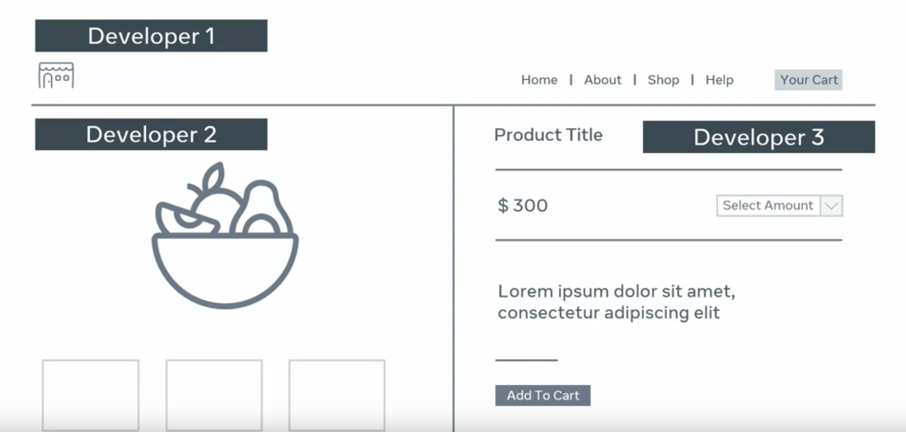
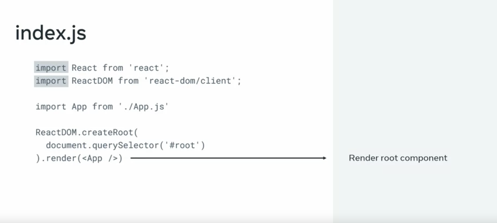
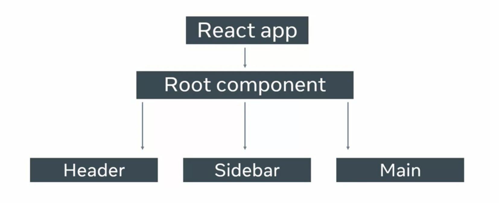
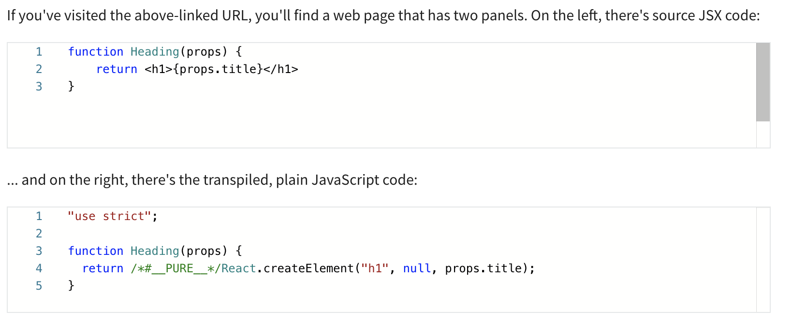
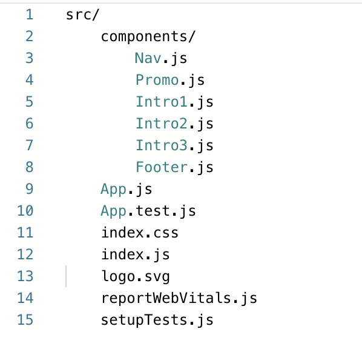
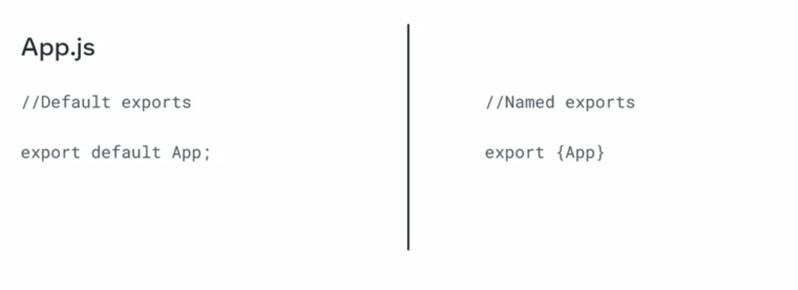

# React Basics

## Week 1 Notes

### React Overview

React uses single page application **SPA**, a one page website which differs from traditional websites where each webpage needs to loaded on navigation.

Traditional websites can be considered inefficient due to reloading of same components (e.g. headers and footers) on navigation.

SPA offers:

- Rich user interfaces
- Speed
- Scalability and flexibility

React revolves around the use of components. Which gives ability for developers to work on separate components on the same project without interference with each other. Think of an entire website as loads of components.



Each component are self-contained, which means they each contain its own HTML, CSS, and JS/TS.

Traditionally, when building loads of components on a single page. It required complex DOM manipulation, complex layouts resulting in whats known as 'spaghetti code'. React prevents this by preventing manipulation of the DOM. Instead, it provides a virtual DOM - an in memory representation of the real DOM, used to update the browser DOM when needed, increasing the application speed and performance.

### Functional Components

React provides two types of components:

- Functional components
- Class components

In the default react application, only one component is rendered - App component. This is located in the index.ts file. Thie is the root component.



Root components can contain other components needed for the web application.



This is converted into a DOM fragment and placed into the existing DOM under the div tag with `id="root"`

A typical react component module contains the component and how its rendered, and an export to make it available for use by the application.

TSX is a syntax extension to typescript containing HTML and TS to make the website more dynamic. You can place this syntax inside a return statement of a functional component.

React components won't render until its used as a tsx element.

React components must be capitalised e.g. `Heading.ts` as react treats lower case components as regular HTML elements.

```tsx
<CustomInput></CustomInput>

// -vs-

<input></input>;
```

The ability to write TS and HTML in the TSX file is made possible with transpiling - interpreting a programming language and translating it to a specific target language.

## Creating React Components

Nothing to add here

## Transpiling TSX

A browser cannot understand TSX syntax. Therefore, React code requires a lot of supporting technologies such as a **transpiler**. This takes a piece of code and transforms it to another.

E.g. Code written in ES6 being transpiled to ES5 syntax:

```tsx
const PI = 3.14;

// to

var pi = 3.14;
```

Babel is a an example of a code transpiler that can transpile TSX code to plain JavaScript code.



## React Project Structure

- public
  - Contains assets and index.tml where the root dom lies
- node_modules
  - Contains all the packages needed for the application to run
- src
- package.json
  - list of dependencies
- packages.lock.json
  - dependencies across different machines to ensure rebuild efficiently

## Customising The Project

**An example approach**

### Building a Layout

A client has approached you to build a complex website layout using React and will consist of the following:

- Main navigation
- Promo (main advertisement)
- List of newest posts' previews (intros)
- Footer

### Organising Your Code

You can refer to [React Docs](https://reactjs.org/docs/getting-started.html) which suggests two approaches:

- Grouping by features
- Grouping by file type

It is advised not to nest the folders too deep. If the project is small, you could keep it simple by just adding a **components** folder and storing all components within this.

### Building The App

Use npm or yarn to install a boilerplate react application. For a simple react application you can just add a components folder with your components like this:



At this point, you have all the components required for the spec listed. This is based on some best practices as suggested by the React docs website and level of complexity for the project itself.

### Building Components

Refer to project `"5. React Basics/Week 1 Code/my-first-app"`. To view the code example of these components.

## Importing Components

### Export statement

Export statements help stand-alone units of code be reuseable.

There are two types of exports.



- export default
  - Used to export only one value from a file and is the same as the filename
- Named export
  - Import name must be the same as export name

### Component -vs- Module

Components are small piece of functionality like a button. Modules are larger than components and can be a series of components in the same file. This helps modular programming and compliments Reacts programming architecture.

### Import statement

Example import statement

```tsx
import React from "react";
import ReactDom from "react-dom/client";

import App from "./App";
```
