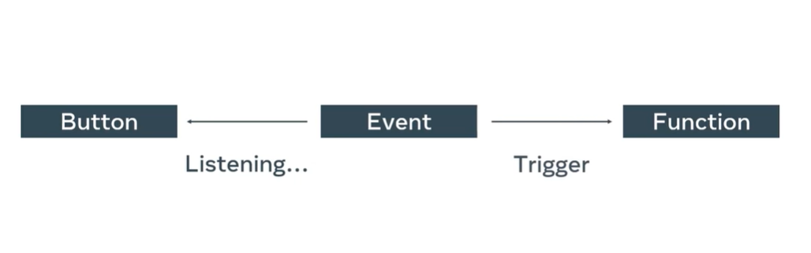

# React Basics

## Week 2 Notes

### Dynamic Events And How To Handle Them

Events require some sort of action to occur. They listen for specific action in order to call its respective funtion.

### Eventful Issues

